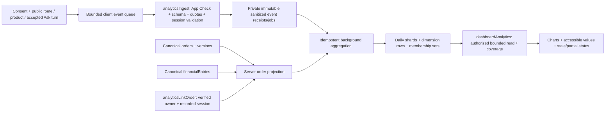

# SATSUNICGO-ANALYTICS-DASHBOARD-20261008 v1

Status: APPROVED_FOR_IMPLEMENTATION. Human approval in the current task on 2026-10-08; implementation and review/test/fix loop authorized.
Date: 2026-10-08. Source base: `53d59bd88fa7da9d1243692336ecd09b6540ea31` plus existing unrelated worktree changes.

## Requested outcome

Redesign CRM Tổng quan with useful charts, then integrate website visits, product interest, Ask topics and verified buying outcomes through a reliable backend/background flow. Execute implementation → review → test → fix → fresh review after approval. The second user message adds tracking, conversion, popular products/questions, performance and background aggregation to the initial chart request.

## Verified current system and gap

- React 19.3, TypeScript 6.0, Vite 8.3, npm; Firebase 12, Admin 14, Functions 7 targeting Node 22; Zod, Vitest, ESLint and Playwright are already installed. No chart dependency is declared.
- Repository Intelligence Gate ran and one refresh completed. CodeGraph is current/healthy; CocoIndex subsequently reports stale/unhealthy. Status remains DEGRADED. Structural queries, semantic discovery and bounded current source inspection were used; index results include generated output and are not complete coverage evidence.
- `Dashboard.tsx` → `operationalDashboard` in `functions/src/crm.ts`: OWNER/OPERATIONS_MANAGER, verified Google, App Check in production; UTC interval ≤31 days; ≤100 records/source. Nine overlapping queue counts cannot produce total orders, revenue, conversion or daily trends.
- `orders` has authoritative `id`, `ownerId`, `market` (US/JP/KR), `createdAt`, `version`, `stage`, purchase kind, collection/refund fields. There are twelve real lifecycle stages. There is no verified stage for arrival at a Vietnam warehouse; do not invent one from the example images.
- `financialEntries` records payment/refund/reversal in VND. PayOS allocation, verified transfers and finance adjustments create these server-side. Entries do not consistently identify deposit versus final installment. A browser redirect/button is not a payment confirmation. Membership payments are separate.
- Product discovery uses `CatalogCard`, `ProductsCatalog`, `ProductDetails`, Ask catalog results, product checkout and cart. Ask has local FAQ and workflow branches before model/API calls. Instrumenting only `functions/src/ai/ask.ts` would miss accepted local questions.
- Bounded search found operational AI telemetry and consent for other purposes, but no implemented first-party visitor/product-click/Ask-topic analytics pipeline. Existing broad Ask plan lists customer-intelligence events as later gated work; that is not approval for this new scope.
- Shared frontend listener is present at 127.0.0.1:5207. Browser `/crm` shows the staff sign-in screen. Current authenticated dashboard integration was not verified. No service was restarted or data reseeded.

## Data meaning and charts

| Metric | Counting rule / source | Presentation |
| --- | --- | --- |
| Lượt xem trang | Accepted public route-view events; one logical navigation ID, exclude CRM/private account routes, reload is a new view | Daily line/area; recorded views only |
| Phiên truy cập | Server-issued visit session; ends after 30 min inactivity, counted once at start | KPI + daily counts |
| Trình duyệt truy cập | Random consented browser identifier; exact distinct union within selected period | KPI; never label as distinct humans |
| Tài khoản truy cập | Distinct authenticated subjects observed in recorded sessions, server-derived identity | Secondary KPI; no email/name exposure |
| Khách có đơn thanh toán | Distinct order owners with an authoritative positive payment entry recorded in period | KPI; includes verified custom deposit, not delivery/completion |
| Phiên có đơn thanh toán | Recorded sessions with a verified owned-order attribution and first positive payment within 7 days of session start | Cohort KPI and conversion chart |
| Tỷ lệ phiên có đơn thanh toán | Distinct converted sessions / recorded sessions started in selected period; each numerator belongs to denominator; as-of time shown | Conversion funnel/table; zero denominator → — |
| Sản phẩm được quan tâm | Separate product detail views, explicit product selections/clicks, and catalog paid-order occurrences | Top 10 bars + sortable accessible table |
| Từ khóa/chủ đề Ask | One accepted logical question turn across local/API paths; retry same turn does not count twice; bounded approved topic/brand/product vocabulary | Top 10 bars, question count and unique recorded sessions |
| Thu đã ghi nhận | Sum of valid positive VND payment entries by ledger `createdAt` | Owner/finance-authorized money area chart |
| Hoàn / đảo đã ghi nhận | Separate refund and reversal series; net = payments − refunds − reversals, may be negative | Separate series/values; never call this revenue/profit |
| Đơn và nguồn hàng | Distinct canonical orders, created-at cohort, current market | Daily stacked columns US/JP/KR; unsupported market shown as unclassified |
| Trạng thái đơn | Current mutually exclusive stage for orders created in selected period | Donut with direct labels; separate from overlapping action queues |

Visitor/browser/account/session counts are different units. Daily unique counts must not be added to produce period uniques. Product clicks count activations, not impressions or purchases. Conversion is attributed, recorded-session conversion; unrelated total purchasers cannot be divided by measured visitors. Last seven days have incomplete conversion observation and are visibly provisional. Late confirmations after the 7-day window remain in total payments but not the cohort rate. No retrospective visitor/click/Ask history is fabricated before activation.

The product funnel is a nested subset: recorded session → product-view session → that product-view session with an attributed paid order. General recorded-session conversion also includes custom purchases without a product page and is shown separately. Never put all paid sessions beneath product viewers as if they were a subset. Product paid-order counts require the canonical catalog payable to have been reached by verified net allocation; one order/product counts once, not once per installment. Custom payers and gross verified-payment customer metrics retain their separate deposit-inclusive definition.

## Reading path and UI contract

- Preserve compact CRM chrome, shared `CrmHeading`, `PageTabs`, `LoadingState`, date validation and current queue destinations. Blue/white/navy, thin borders, large meaningful KPI numbers; use reference images for chart families only.
- Two tabs: **Khách hàng & mua hàng** (default: visitors, conversion, popular products, Ask and money) and **Vận hành** (orders by market, exclusive stages, current action queues).
- First scan: selected period + as-of/coverage → four focal KPIs → traffic and conversion → products and Ask. Money is a distinct panel with its own unit and permission. Do not plot money and counts on one ambiguous axis.
- 1/7/30-day presets and custom ≤31-day UTC periods; URL-backed tab/range, stable on reload/back, invalid URLs safely use default and explain correction. Product/queue links disclose any destination filter difference.
- SVG charts owned by local React components, no new runtime dependency; ≤6 visible instances per tab, ≤31 daily points/series, top 10 rows. Linear interpolation only; no decorative motion. Zero/all-empty donut has no fabricated arc. Accessibility table is always available; values do not require hover. Tap/focus point selection and keyboard step controls work on mobile.
- Portrait 320/390 px: KPIs reflow, focal chart first, rankings stack, date form collapses. Desktop 1440 px: trend/conversion pair then rankings. Check 200% zoom, text expansion, contrast, focus and reduced motion.
- Loading, genuine zero, not-collected, unavailable, forbidden, stale, provisional, malformed and partial states are distinct. Preserve last valid data for same authorized scope while retrying; clear all private analytics on sign-out/permission denial; old requests cannot replace newer filters. Each block carries collection start, aggregation as-of and coverage.
- Planning preview: `docs/previews/SATSUNICGO-ANALYTICS-DASHBOARD-20261008.html`; all values are placeholders and chart marks are explicitly illustrative, not observed statistics.

## Proposed backend flow

### Collection and trust boundaries

1. Consent is separate from marketing/feedback/memory consent. Default off; refusal does not impair browsing, Ask or purchase. Add a compact bilingual opt-in and later withdrawal control plus factual privacy explanation. Do not send analytics before consent. Server verifies a supported consent version and recorded session; client consent is a user preference, not payment authority.
2. Session creation returns a random opaque capability; browser supplies no UID/role/paid amount. Backend derives authenticated identity from verified auth. Rotate session ownership on login/logout/account switch; no fingerprint, raw IP storage, full URL/query/referrer, address, email, phone, uploaded image, payment reference or raw Ask text in analytics. IDs are pseudonymous private data, not claimed irreversible anonymization.
3. Client queue: ≤100 events, ≤64 KiB, batches ≤20, debounce about 3 s, bounded three retries/backoff, same event IDs across retry. Cancel timers/listeners and clear queue/identifier on withdrawal/account boundary. A dropped event is a recorded coverage limitation. Never await analytics on rendering, Ask response, cart or checkout. Hidden tab flush is best effort; no guaranteed beacon delivery claim.
4. `analyticsIngest` validates allowlisted event/version/route/topic/product/session fields, request size and timestamp windows; server receive time is authoritative. Validate product IDs against public catalog; bound taxonomy cardinality. Enforce App Check outside demo, per-session/authenticated-subject quotas plus bounded instance/concurrency and a server-disabled-by-default policy. App Check and quota controls reduce abuse; they do not prove a browser event came from a human. No raw security tokens in receipts or logs.
5. Event receipts and aggregate application are transactional/idempotent. Workers can receive duplicate/out-of-order events; each stable source ID applies once. Order projections read the latest canonical version and compare against stored version; old versions cannot move state backward. Financial entry projection uses immutable entry ID and validates kind/currency/amount/order relation. Refunds/reversals do not rewrite gross payment history.
6. Attribution uses a separate `analyticsLinkOrder` read/ownership check + sidecar record after an order is confirmed created/recovered. It covers direct checkout, cart-created orders and custom/Ask order results. It does not extend critical command payload hashes or change payment writers. Server rejects another account's order, expired/unrecorded session or changed attribution. Late linking/payment events are reconciled in background. Unlinked orders count in total paid customers but never in the session numerator; show attribution coverage. This trades some attribution loss for isolation from financial transactions.
7. Ask instrumentation occurs once after input is accepted and the logical turn ID is fixed, before local/API routing. Classify only approved topic/product/brand IDs; server validates those codes. No raw question or sensitive arbitrary keyword persistence. Questions and confirmations to create/pay/cancel are separate event types. Keep unknown topics as “Khác / chưa phân loại”, rather than guessing meaning. Publish a keyword row only with at least five distinct recorded sessions; this threshold is disclosure minimization, not a guarantee of anonymization.

### Background, storage and performance

- New private analytics collections: session/subject mappings, ingest jobs/event receipts, processed-source receipts, entity projections, attribution sidecars, daily counter shards, per-day product/topic rows, unique-membership rows and completed dashboard snapshots. Default Firestore deny rules already protect unlisted collections; test that clients cannot read/write them. No broad rule grant.
- Separate `analytics-worker.ts` and scheduled compact/retry worker; do not reuse or slow email/order outbox. Trigger wrappers only consume committed `orders`/`financialEntries` and sanitized analytics jobs. Never acknowledge an event as aggregated before transaction commit. Transient failure remains retryable; invalid data goes to a bounded dead-letter state with reason codes.
- Use deterministic 16-shard assignment for frequent day counters. Compact on a proposed 1-minute schedule, bounded batches (initial 100 jobs/tick) and checkpoint. Count backlog, accepted/rejected/dropped events, last successful tick, oldest pending age and retry/dead-letter counts; no sensitive payload logging. These are tuning defaults, not proven throughput or SLO.
- Dashboard reads projections/snapshots, never scans orders/chat/ledger from the browser. Cache results per range/role/schema for 60 s; forbid cross-role financial cache reuse. Same-source/as-of snapshots avoid inconsistent denominators. Expired cache does not imply zero.
- Exact range uniques use union of retained membership keys, not sum of daily uniques. Cursor-page with a hard 10,000 membership/read-work bound; if exceeded, mark affected exact KPI unavailable and recommend smaller range. Do not silently estimate or return a sampled rate. Summing dimension rows uses all covered rows before top-10 sorting; merging only daily top-10 lists is invalid.
- Proposed retention for review: raw sanitized events 7 d; session/dedup/membership/attribution working data 45 d; non-identifying aggregates 365 d. Cap late event acceptance at 24 h so events cannot reapply after receipt expiry. Financial-source processing keeps a versioned durable projection/receipt for its retained aggregate horizon; stale source events beyond that horizon are rejected, not blindly recounted. Cleanup affects only analytics data, never canonical orders/ledger/audit. Historical unique/conversion panels outside retained detail show unavailable; older aggregate daily charts can remain available.
- Lifecycle cleanup is bounded/batched in an analytics-owned scheduled task. No TTL/IAM setup or production deletion is executed during local implementation. Production retention activation requires the reviewed release step.
- Initial targets to measure: tracking does not delay existing product/Ask/checkout promises; ≤1 extra batch request per 3 s active interaction; ≤64 KiB dashboard response; no unbounded collection scan; no timer/listener accumulation under repeated mounts. Measure cold/warm worker/API latency, reads/writes per 1,000 events and backlog recovery using synthetic data. Change limits only with evidence and delta approval if scope/risk changes.
- Analytics outage must preserve business flows. Disable collection/UI activation with an approved policy; already committed financial/order records stay authoritative. Maintain explicit last-known snapshot and delayed/partial coverage state.

## File-by-file implementation scope after approval

| Path | Planned change / responsibility |
| --- | --- |
| `packages/domain/analytics.ts` (new) | Versioned event/read schemas, UTC buckets, metric definitions, safe topic vocabulary, distinct/cohort helpers |
| `functions/src/analytics-ingest.ts` (new) | Session/consent envelope, schema/quotas, private ingest receipts, owned-order sidecar linking |
| `functions/src/analytics-worker.ts` (new) | Idempotent event/order/financial projections, sharded deltas, retry/dead-letter/compaction/cleanup wrappers |
| `functions/src/dashboard-analytics.ts` (new) | Verified role-scoped reads, range/unique bounds, cached snapshots, coverage and as-of metadata |
| `functions/src/index.ts` | Narrow export additions only; preserve all current Ask/workspace WIP |
| `firestore.indexes.json` | Only indexes required by new pending-job/range/membership queries; declare index exemptions for non-query payloads if needed |
| `src/shared/analytics.ts`, `src/shared/AnalyticsConsent.tsx`, `src/shared/analytics-consent.css` (new) | Independent consent/session/queue lifecycle, route event hook and bilingual control |
| `src/app/App.tsx` | Mount analytics observer/consent in existing public shell; private-route and staff exclusion |
| `src/features/content/CatalogCard.tsx`, `ProductsCatalog.tsx`, `ProductDetail.tsx` | Stable canonical product IDs and explicit click/detail-view instrumentation; no impression→view substitution |
| `src/features/content/PrivacyPage.tsx` | Explain approved analytics purpose, data fields, refusal/withdrawal and actual retention separately from operational retention |
| `src/features/ask/Ask.tsx`, `CatalogSearch.tsx`, `Commerce.tsx`, `CatalogPurchase.tsx` | Accepted-turn/topic and explicit product event hook; owned confirmed/recovered-order attribution; preserve current concurrent changes |
| `src/features/products/Checkout.tsx`, `src/features/cart/cart-store.tsx` | Link verified newly created/recovered order IDs to recorded session; no payment-result inference |
| `src/features/crm/Dashboard.tsx`, `dashboard094-model.ts`, `dashboard094.css` | Read analytics contract, tab/URL/filter state, KPI/chart hierarchy and honest data states; retain existing operational fallback semantics |
| `src/features/crm/DashboardCharts.tsx` (new) | Bounded reusable SVG line/area/donut/stacked/ranking charts + table alternatives |
| `tests/unit/analytics.test.ts`, `analytics-client.test.ts`, `dashboard-analytics.test.ts` (new), relevant dashboard unit suite | Meaningful bucket/unique/cohort/money/topic/idempotency/client-lifecycle/schema regressions |
| `tests/rules/analytics.test.ts` (new), relevant server regressions | Real emulator permission, tampering, duplicate/concurrent worker, source/sidecar/aggregate and deny-rule tests |
| `tests/browser/analytics-dashboard.spec.ts` (new), `dashboard094.spec.ts` | Consent/client events/real render/malformed/zero/stale/auth/race/mobile/keyboard/integration coverage |
| `docs/reviews/ANALYTICS-DASHBOARD-20261008/**` | Scoped manifest, product-content review, actual QA results, performance evidence, each review/fix cycle, completion report |

No dependency additions are proposed. Preserve existing callable payloads, pricing, auth/MFA controls, financial writers, cart semantics, Ask permissions/provider gates and regulated source retention. Production deployment/activation, backfill, shared service restart/reseed, IAM/TTL, billing changes and unrelated WIP are outside this approval.

## Access, risks and alternatives

- Analytics page: OWNER/OPERATIONS_MANAGER, active unlocked staff and user records, verified Google, production App Check. Money block additionally requires existing finance authority (OWNER or FINANCE); on the current overview route this means OWNER or manager+FINANCE. No new FINANCE-only CRM route access. Unauthorized finance data is never sent in a general snapshot.
- Risk: HIGH for visitor identity/attribution, private analytics and financial interpretation; MEDIUM for background jobs/storage/query load and internal contracts. No source-money mutation is proposed.
- Browser signals remain untrusted behavioral observations. Consent blockers, offline loss, blockers and missing attribution produce undercoverage. Surface the scope instead of representing analytics as all humans/all purchases.
- Alternative frontend-only queue charts are inexpensive but cannot satisfy visits, buyer conversion or Ask popularity. Third-party GA integration would add external data sharing/configuration and would still need canonical payment reconciliation. Large unbounded source scans would provide poor performance and weak failure behavior. Prefer first-party bounded event/projection flow using installed infrastructure.
- No linked work item, approved analytics retention or production throughput baseline is available. Proposed defaults become part of the scope to be reviewed. Direct local read-model evidence must not be called production proof.

## Validation and loop acceptance

1. Scope/source freeze: hash touched files and preserve concurrent WIP; validate approval record for every protected path. Recheck delta before each new integration phase.
2. Unit/schema checks: logical event retry, StrictMode/remount, multi-tab/reload, UTC midnight/31-day bounds, distinct union, zero denominator, cohort numerator subset, 7-day cutoff, safe integer sums and negative net, missing/invalid entries, top-10 over full candidate rows, keywords/PII rejection, late/out-of-order/replayed source events.
3. Emulator integration on existing demo services: guests cannot query dashboards/write aggregates; roles/locked user/MFA cases, forged order/session/payment flags, concurrent duplicate batches and trigger retries, order/payment/attribution arrival permutations, stage version races, worker failure/recovery, completeness bounds and default deny rules. Use uniquely prefixed synthetic analytics fixtures and targeted cleanup only; never reset shared settings/data. Existing rules harness hardcodes another port in some suites, so create a scoped existing-emulator configuration before execution rather than starting new servers.
4. Browser: public visit → consent decision → product click/view → accepted local/API Ask → owned created/recovered order → confirmed payment → worker → dashboard. Include refusal/withdrawal, account switch, reload/back URL, retry unchanged event ID, offline/batch overflow, stale snapshot, auth revocation, no fake zero, 320/390/1440 px, 200% zoom, keyboard/touch values and reduced motion. Synthetic transport checks are explicitly separated from authenticated shared-app/emulator integration.
5. Checks: focused Vitest tests; scoped ESLint and formatting; `npm run typecheck`; `npm run build`; focused rules/API and browser suites with verified shared-port config. Record baseline failures from unrelated WIP separately and do not claim broad green status from focused passes.
6. Performance: measured request/body/query/event/cardinality bounds; controlled synthetic event bursts and duplicate storm, no hot single global counter, worker backlog drain, cache segregation, no business-promise coupling. Environment/backend load beyond tested limits remains NOT_VERIFIED.
7. Mandatory product review using `.ai/templates/product-content-review.md`: inventory Vietnamese/English strings and all states; Purpose, Agency, Responsibility, Familiarity, Flexibility, Simplicity, Craft, Delight; web platform fit; in-context current screenshots and accessibility evidence.
8. Final `final-implementation-review`: requirement match, security/privacy/abuse, correctness/quality, failure/concurrency/retry, error/lifecycle/operator visibility, production limitations and tradeoffs. Fix approved findings → affected verification → fresh review until PASSED; a missing/stale/failed review blocks successful handoff. Record every cycle without predeclaring success.

Delivery weights: truthful metric contracts 15%; collection/consent 20%; canonical outcome/attribution 20%; worker/performance 15%; charts/accessibility 15%; executed validation/current final review 15%. All implementation criteria are NOT_STARTED at this planning checkpoint. Token usage and actual billed cost are Unavailable; memory candidates: None.

## Approval requested

Approve **SATSUNICGO-ANALYTICS-DASHBOARD-20261008 v1** for the exact local application/backend/background/chart/test scope and proposed consent/retention/attribution definitions above. Record human approver/task reference and constraints before protected edits. This approval does not authorize production rollout or source-data backfill.
