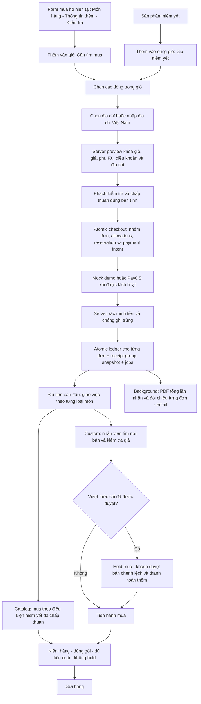

# SatsunicGo - thanh toán 100% và chứng từ PDF

Plan ID: **PAYMENT-UPFRONT-20261008 / v2**. Trạng thái: **PROPOSED - chờ duyệt kế hoạch**. Ngày: 2026-10-08. Rủi ro: HIGH. Người triển khai duy nhất dự kiến: root; giữ nguyên WIP của các công việc khác.

## Mục tiêu và giới hạn bằng chứng

Hoàn thiện luồng web + backend + Firestore + background worker cho thanh toán toàn bộ ban đầu, khoản thu thêm được giải thích rõ, và PDF riêng cho mỗi lần tiền được xác nhận. Dùng cổng giả lập ở demo trong lúc PayOS chưa thiết lập xong. Rà soát -> sửa trong phạm vi duyệt -> chạy kiểm tra -> rà soát mới cho đến khi vượt các gate bắt buộc.

Đã kiểm tra source hiện tại: listing đã trả 100%; custom vẫn cọc 50%; chưa tự tạo/gửi PDF khi nhận tiền. Intelligence gate DEGRADED do chỉ mục cũ, dù refresh một lần và health pass; đã dùng CodeGraph, CocoIndex và source đối chiếu. Chi tiết: [intelligence](../reviews/PAYMENT-UPFRONT-20261008/INTELLIGENCE.md), [review](../reviews/PAYMENT-UPFRONT-20261008/REVIEW.md). Đây chưa phải bằng chứng PayOS, email hay thanh toán production đã chạy.

## Quyết định nghiệp vụ đề xuất

Hai câu hỏi về thành phần tiền ban đầu và loại hóa đơn đã gửi để xác nhận. Nếu chưa có câu trả lời, kế hoạch v2 dùng các giả định dưới đây; duyệt v2 cũng duyệt các giả định này, có thể chỉnh chúng khi duyệt.

1. **Custom mới:** khách nhập giá đã tìm hiểu của từng món, số lượng, lựa chọn và tiền nguồn (USD/JPY/KRW theo thị trường). Backend quy đổi số nguyên, khóa tỷ giá/điều khoản/chính sách phí vào bản tính. Khách xem tổng và xác nhận, trả **100% giá hàng dự kiến + phí mua hộ và các chi phí đã xác định** ngay; không chờ nhân viên báo giá rồi mới trả cọc 50%. Cước chưa xác định hiển thị “Chưa chốt” và được thu cùng khoản còn lại khi chốt chi phí.
2. **Không tự bịa phí:** mở rộng chính sách phí có phiên bản và phê duyệt OWNER/MFA. Chỉ cho tạo nghĩa vụ thanh toán khi tỷ giá, điều khoản và quy tắc phí hợp lệ. Không lấy một giá tham khảo vận chuyển hoặc ngân sách làm tổng phải trả. Demo dùng số liệu minh họa được phân biệt rõ; production phải có chính sách thật được duyệt.
3. **Listing:** giữ giá niêm yết trọn gói đã xác nhận trên server, trả 100%. Giỏ dùng chung catalog và custom; một lượt checkout trả tổng một lần. Nội bộ giữ một đơn cho từng lựa chọn catalog và nhóm custom có cùng thị trường, điều khoản và chính sách để bảo toàn hợp đồng. Không gộp hai loại thành một tổng cuối không phân biệt. Không thêm khoản tăng giá tùy ý cho listing vì hợp đồng hiện tại khóa tổng trọn gói. Nếu không thể mua đúng điều kiện, tạm giữ và xử lý với khách qua hỗ trợ/hoàn tiền, không tự sửa giá đã mua.
4. **Chi phí thực tế custom:** nhân viên có quyền/đơn được phân công ghi nhận giá thực tế và bằng chứng. Bản điều chỉnh có số phiên bản, từng thành phần, chênh lệch và lý do. Khi biết giá tăng trước mua, gửi khách duyệt thay vì tự mở rộng mức chi đã chấp thuận. Nếu chênh lệch được xác định sau mua, khách xem bản chốt và trả phần còn lại trước gửi hàng. Có thể duyệt giá mua sớm; cước chỉ được duyệt khi đủ thông tin, không hứa luôn chỉ có đúng hai giao dịch.
5. **Khách không đồng ý giá tăng:** đặt hold và chuyển xử lý; không coi im lặng là đồng ý, không tự mua với giá vượt mức cho phép, không tự thu thêm. Đã mua rồi không hứa tự hủy/hoàn tiền nếu quy trình chưa xác nhận được.
6. **Giá giảm/tiền thừa:** hiển thị số dư thừa và chuyển quy trình tài chính đang có; không tự hoàn tiền hay sửa sổ. Khách có yêu cầu hoàn tiền đang chờ thì tạm chặn tạo khoản thu mới, hiển thị khoản giữ và lý do chưa thể gửi hàng; giải quyết xong mới tính lại nghĩa vụ.
7. **PDF:** trước mắt là **Phiếu xác nhận thanh toán**, có thương hiệu, tìm kiếm/copy được chữ, tiếng Việt đầy đủ, thông tin đơn/món/phí/tỷ giá/điều khoản và đối chiếu từng khoản. Tạo sau một financialEntry đã xác nhận, không sau redirect hoặc thông báo khách “đã chuyển”. Tách phiếu trả ban đầu, phiếu trả thêm và bảng chốt đơn; không gọi chứng từ nội bộ là hóa đơn thuế. Nếu cần hóa đơn VAT, phải bổ sung hợp đồng phát hành với pháp nhân/nhà cung cấp và dữ liệu thuế xác minh.

## Luồng đề xuất

Redirect chỉ mở màn hình “Đang xác minh thanh toán”; trạng thái đã trả đến từ server. Listing đi qua kiểm hàng/đóng gói và không có nhánh tăng giá. Một khoản trả thêm có thể gộp chênh lệch giá, phí theo chính sách đã chấp thuận và cước mới chốt, với bảng phân tích cụ thể trước xác nhận.

## Thiết kế nghĩa vụ tiền và tương thích

- Thêm `paymentPolicyVersion` trên **đơn mới**: `custom-upfront-v1`, `catalog-full-v1`; đơn custom cũ thiếu trường giữ logic `legacy-deposit-v1`. Không đổi các báo giá đã chấp thuận/tiền đang thu; không backfill nghĩa vụ hay bút toán production.
- Giá nghiên cứu là ước tính người dùng nhập, không phải giá đã được nhân viên xác minh. Kiểm tra số nguyên tiền nhỏ nhất và quantity; dùng BigInt/rational FX, làm tròn VND theo quy tắc được công bố, kiểm tra tràn và tổng. Market/currency phải khớp; không lấy giá từ LLM hay scrape tùy ý.
- Bản tính server bao gồm item/quantity/options hash, sourceMinor/currency, goodsVND, fee components, membership snapshot, pricing/terms versions, expiry, shipping status và tổng phải trả hiện tại. Khách chấp thuận một phiên bản chính xác. Thay đổi món/giá/qty trước trả làm hết hiệu lực bản tính; thay đổi sau trả đi qua proposal hiện có và xét ảnh hưởng tiền.
- Khoản thu ràng buộc order, owner, policy, obligation revision, purpose (`initial`/`additional` với tương thích full/deposit/balance cũ), amount VND, provider, operationId, attempt generation và immutable context hash. Server tự tính amount; client không gửi số tiền có hiệu lực thu.
- `netCollected = collected - refunded`; phần bị giữ hoàn tiền hiển thị riêng và không dùng mua/gửi hàng. Không thu lặp để bù refundReserved. Nghĩa vụ thiếu tiền chỉ được thu khi bối cảnh tài chính không đang bị hold/đối chiếu.
- Chốt mua cần đủ tổng ban đầu theo policy; chốt gửi cần approved final revision, đủ tiền sau refund/reservation, đóng gói đủ, đúng freight version, không hold và không khoản tài chính chưa đối chiếu làm mất an toàn. Thanh toán đủ ban đầu không có nghĩa đã gửi hay tổng cuối đã chốt.
- Hồ sơ mua thực tế phải lưu được sự thật kể cả khi nhân viên phát hiện vượt mức cho phép sau mua: ghi nhận ngoại lệ/hold và chuyển xử lý, không biến việc ghi hồ sơ thành tự động chấp thuận khoản vượt giá. Không tạo quyền chi tiền vô hạn từ giá người dùng nhập.
- `requiredDeposit` và acceptance legacy vẫn nguyên để tương thích. Helpers mới tập trung quyết định chính sách; mọi UI/Ask/backend dùng cùng contract thay vì đổi phép chia 2 toàn cục.

## Cổng mock và ranh giới PayOS

- Tách adapter provider khỏi áp dụng nghĩa vụ/sổ, giữ PayOS SDK hiện tại. Mock có checkout/status/cancel/confirm backend ở môi trường demo; chỉ nhận owner đã xác minh cho đúng intent còn hiệu lực. Backend mock tự sinh chứng cứ giao dịch; payload UI không được ghi collected hay financialEntries.
- Mock chỉ chạy khi: FUNCTIONS_EMULATOR=true, project từ env **và Firestore thực tế** là demo-satsunicgo, loopback emulator host/port hợp lệ, explicit demo configuration. Từ chối cấu hình chéo dự án hoặc kết nối DB production. Không khởi tạo PayOS SDK/đọc PayOS secrets để chạy mock.
- Release artifact/exports production loại các mock callable; code guard vẫn từ chối mock nếu cấu hình vô tình lọt. Client production không có thao tác mô phỏng trả tiền hoặc URL HTTP ngoại trừ runtime demo loopback xác minh. Mock proof dùng provider namespace riêng, không giả chữ ký PayOS, không QR chuyển tiền thật.
- Cùng logic server áp dụng một giao dịch đã xác minh: receipt/reference dedupe -> kiểm tra merchant/currency/amount/obligation -> transaction order/ledger/intent/job/audit. Số tham chiếu trùng không cộng tiền lần nữa. Sai/thiếu/thừa/đến muộn hoặc phiên bản cũ chuyển đối chiếu an toàn, lưu được tiền đã đến; không tự làm paid vì intent hay returnUrl nói vậy.
- Một khoản thiếu/thừa hoặc tham chiếu mới đến intent đã trả, nếu chứng cứ provider xác minh đúng merchant và ánh xạ đúng đơn, đặt financial review hold và chặn yêu cầu thu mới cho đến đối chiếu. Không thu lại nguyên tổng trong lúc khoản chuyển trước chưa được phân bổ. Input/chữ ký không hợp lệ không được tạo hold cho đơn hợp lệ hay lấp hàng đợi bằng dữ liệu tùy ý.
- Hồi phục creating/unknown với lease, request context và authenticated provider readback. Không gọi provider trong Firestore transaction; timeout/unknown không tạo thêm giao dịch mới. Chỉ tạo attempt mới sau xác nhận terminal/unpaid; webhook đến muộn được giữ đối chiếu.
- Theo [tài liệu PayOS](https://payos.vn/docs/moi-truong-test/), không có sandbox riêng. Mock SatsunicGo chỉ là local demo. Tích hợp sống, cấu hình merchant/secrets/webhook/IAM và giao dịch thật là gate riêng khi chủ sở hữu hoàn tất setup; không lấy demo PASS làm PayOS PASS.

## PDF và background delivery

- Transaction tiền vào tạo receipt snapshot/job deterministic theo financialEntry ID; gồm số tiền riêng của lần nhận, purpose, paidAt timezone rõ, policy/terms, items/prices/fees đã chấp thuận, amount previously paid, net/refund và known liability tại thời điểm nhận. Không lấy trạng thái đơn mới hơn để sửa phiếu cũ. Mỗi lần trả thêm có phiếu riêng và liên kết phiếu trước.
- Snapshot chứng từ và chứng cứ ngân hàng tối thiểu; không lưu tài khoản đối ứng, số thẻ, secrets, địa chỉ giao hàng hay nội dung Ask không cần thiết. Định danh người nhận từ authenticated owner; không nhận email tùy ý từ request.
- Node PDF worker riêng (đề xuất PDFKit, thêm một runtime package với phiên bản/lockfile chính xác sau review dependency) và font Unicode được phép phân phối, kèm license. Python/reportlab trong mẫu thiết kế không trở thành dependency Functions.
- Worker claim có lease/CAS và stable object path; render ngoài transaction, upload riêng tư kèm checksum/snapshotHash, rồi commit ready và email job. Crash sau upload có thể đọc metadata/hash để hồi phục mà không dựng phiếu khác. Retry có giới hạn và hàng lỗi; PDF lỗi không rollback tiền, UI giữ thông báo “Đã thanh toán. Phiếu đang được xử lý.”
- Dùng trigger outbox cho phản hồi sớm, bounded scheduled recovery; không scan toàn bộ ledger hay dựng PDF trên đường webhook. Dự kiến tối đa 30 món/phiếu, 8 trang, 3 MB, concurrency 2, lease 5 phút; kiểm tra giới hạn thực tế, không cắt nội dung tài chính để ép vừa trang.
- Bổ sung metrics không chứa PII: số intent đang xác minh, intent creating quá lease, khoản đối chiếu, tuổi job PDF/email, render failure, ambiguous delivery và hold chưa xử lý. Gắn correlation ID nội bộ; cảnh báo cần người xử lý, không ghi dữ liệu ngân hàng/khách hàng vào metric label.
- Download đọc quyền owner/staff ở server; private Storage, không public download token lâu dài. Không mở rộng share hiện tại để lộ buyer/payment identity. Dùng HTML chi tiết chứng từ làm đường đọc accessible song song PDF.
- Demo mail sink lưu envelope đã render và PDF gắn kèm vào inbox owner riêng tư, có trạng thái “Email demo”; test cùng renderer, recipient validation và outbox state machine. Live SMTP tiếp tục held. Khi live bật sau setup, gửi attachment thực sự; stable Message-ID, leases, unknown outcome không resend mù và không hứa exactly-once SMTP.
- Chứng từ không áp dụng TTL tự xóa cho sổ, giấy tờ hoặc dữ liệu đối chiếu; retention tài chính/pháp lý cần owner chốt. TTL chỉ dùng dữ liệu vận hành tạm an toàn sau khi terminal, theo policy riêng; dedupe references còn giữ để chống replay. Không xóa receipt để có thể trả lặp.

## Kế hoạch file/function

| Vùng | Tệp/điểm thay đổi | Công việc |
| --- | --- | --- |
| Domain money | `packages/domain/index.ts`, mới `packages/domain/payment-obligations.ts` | policy helpers, initial amount, net/hold/dispatch checks, typed obligation revision; giữ legacy helper. |
| Custom pricing | `packages/domain/request-input.ts`, mới `packages/domain/custom-upfront.ts`, mới `functions/src/custom-upfront.ts` | researched prices, preview estimate, idempotent checkout/acceptance, explicit server fee and FX snapshots. |
| Policy/admin | `functions/src/workspace.ts`, `src/features/settings/Settings.tsx` | approved versioned fee rule/enable policy schema and owner form; preserve authorization/MFA/CAS and unrelated Ask edits. |
| Commands/actual costs | `functions/src/index.ts`, `functions/src/changes.ts`, `functions/src/consolidation.ts`, `src/features/operations/Workbench.tsx`, `src/features/orders/Changes.tsx` | store cost revision/proposal/evidence, approve exact revision, guard purchase/dispatch/refund races; show upfront vs legacy obligation and clear source currency units. No broad CRM rewrite. |
| Payment backend | `functions/src/payments/payos.ts`, mới `service.ts`, `provider.ts`, `mock.ts` under payments | common apply core, intent/status/recovery/expiry; PayOS adapter and local-only mock entry; preserve signature/account checks. |
| Release boundary | `functions/src/provider-release-gate.ts`, `scripts/release/artifact.mjs`, `scripts/release/preflight.mjs`, relevant function export registry | hold live providers, exclude/deny mock and demo mail exports; additive preflight assertions only, no CI workflow redesign. |
| Customer UI | `src/features/requests/RequestForm.tsx`, `request-form.css`, `src/features/products/Checkout.tsx`, `src/features/orders/OrderTools.tsx`, shared payment state view/route | price input, breakdown/consent, full payment, mock demo checkout, authoritative return/status/resume, top-up approval and clear recovery. |
| Ask consistency | `packages/domain/ask-workflow.ts`, draft/action contracts, `functions/src/ai/ask.ts`, `src/features/ask/Commerce.tsx` and affected draft form | researched-price handoff, upfront wording/actions by persisted policy; no AI spending/mark-paid authority. Work with current concurrent edits, rebase hash-bound claims. |
| Public policy consistency | `packages/domain/public-content.ts`, `src/features/content/TermsPage.tsx`, `src/features/content/ProductsCatalog.tsx`, affected published-knowledge source and generator inputs | policy-bound custom payment explanations, preserve historical accepted terms text/versions, publish new knowledge only through existing approved path; avoid showing two installments for new upfront requests. |
| Documents | `packages/domain/invoices.ts`, `functions/src/invoices.ts`, mới receipt/PDF worker + assets/fonts/license, `src/features/invoices/Documents.tsx` | payment_receipt alongside old internal_statement, immutable issuance/private download, final statement preserved. |
| Email | `functions/src/email.ts`, `email-content.ts`, demo inbox adapter | PDF attachment, deterministic receipt job, leased delivery/unknown recovery and local owner inbox; verified recipient only. |
| Rules/indexes | `firestore.rules`, `storage.rules`, `firestore.indexes.json` | new snapshots/private jobs deny direct client writes; owner document access; bounded worker/owner queries indexes. No existing index deletions. |
| Tests/docs | focused unit/rules/browser suites, diagrams, this plan/review/product-content report | scenarios below; immutable source manifest, review cycles and final evidence report. |

Before implementation, inspect attached active worktrees and select a clean current-main base; compare relevant WIP hashes before any integration. Isolated managed worktree preferred for the payment change; never include the dirty primary checkout wholesale. Generated build/assets updated through generators only. Any discovered file outside this bounded scope needs a delta plan if it materially changes behavior.

## UI states và ngôn ngữ

“Giá bạn đã tìm hiểu”, “Trả đủ số tiền ban đầu”, “Cước vận chuyển chưa chốt”, “Chờ xác minh thanh toán”, “Đã thanh toán · chờ mua hàng”, “Xem chi phí phát sinh”, “Cần thanh toán thêm”, “Đã thanh toán. Phiếu đang được xử lý”, “Tải phiếu thanh toán”. Ghi rõ demo trên mock payment và phiếu giả lập.

Input sai chỉ lỗi đúng field, giữ bản nháp khi login/reload/mạng lỗi; tiền/currency theo locale; không đổi khoản đang chờ khi đổi tài khoản. Giá mới/stale phải đọc lại và chấp thuận lại. Cancel checkout không hủy đơn tự động. Unknown phải có kiểm tra lại cùng operation, không nút tạo khoản thu mới. Không access/resource thì thông báo an toàn không tiết lộ đơn người khác. Mobile, keyboard, focus, live-region, 200% text, contrast/reduced motion và nút tải HTML/PDF là acceptance bắt buộc. Product Language Gate phải có inventory từng state và tám nguyên tắc với bằng chứng render trong app; prototype không thay thế gate app.

## Kiểm thử và tiêu chí hoàn thành

Các hướng đã cân nhắc: đổi toàn cục `requiredDeposit` sang 100% ít dòng nhưng sửa cả hợp đồng cũ và vẫn thiếu giá nghiên cứu; giữ nhân viên báo giá trước rồi thu 100% ít thay đổi hơn nhưng không đáp ứng thanh toán ngay từ giá người dùng nhập; chỉ mock SDK trong test không cho khách chạy flow thực tế. Chọn server estimate/acceptance có phiên bản và adapter demo dùng chung sổ: thêm schema/handler/worker có giới hạn, đổi lại giữ được đơn cũ, quyền quyết định giá và đường thay PayOS sau này.

| Nhóm | Phải chứng minh |
| --- | --- |
| Business/domain | Custom mới 100%, legacy 50% không đổi, catalog cap giữ; exact money/FX/qty/fee discount rounding; zero/invalid/overflow; no pricing config => blocked; higher/lower/same cost; approved revision; rejected increase hold; reserved refund freezes collection; reversals/overpayment. |
| Auth/rules | anonymous/other owner/locked account/BUYER unassigned/FINANCE absent MFA denied; client forged amount/price/paid/PDF job/write denied; private PDF cannot read cross-user; production mock and config spoof denied. |
| Payment/concurrency | duplicate clicks/tab/reload, duplicated webhook, two references, wrong merchant/link/currency/amount, stale context, race cancel/refund/finalize/payment, creating crash, SDK timeout, authenticated recovery, expired link/late callback, partial or excess transfer exception. |
| E2E mock | verified customer enters researched price -> server estimate/accept -> backend mock -> ledger+receipt -> buyer price evidence -> customer cost approval -> top-up -> warehouse pack -> dispatch guards -> owner receipt and demo email attachment. Second catalog flow from real versioned demo listing, no quotation/surcharge. |
| PDF/email | initial receipt before final approval, top-up receipt links original, final summary, Vietnamese glyphs/searchable text, long names/30 items/multipage, wrapping/totals, exact money and timezone, no PII leak, stable job/blob/hash, duplicate trigger/crash/retry/lease expiry, SMTP unknown outcome, verified recipient changes and attachment content. |
| UI | real shell at 5207, desktop/mobile, keyboard/text scaling, loading/offline/stale/held/unauthorized/empty/success/PDF pending/failure; natural terminology for initial/additional/legacy; values agree with backend. |
| Performance/background | webhook acknowledgement path excludes PDF/email IO; bounded reads/queues/retries/concurrency, relevant indexes, zero repeated collection on stress, no resource leaks from streams/buffers/temp files; record actual timings, do not invent thresholds as measured results. |
| Build/review | targeted TypeScript/lint/unit/rules/browser/production build and mock-export preflight; review -> approved fixes -> affected tests -> fresh final review until PASSED. Exact candidate hashes, dependency/font license evidence and rollback rehearsal. |

Use current configured test commands and actual loopback emulator identity; inspect listeners first, reuse frontend **5207**. No extra Vite/fixture servers, backend restart/reset or demo reseed without specific authorization. If the missing shared backend prevents E2E, produce exact required runtime operation and ask only after all independent work is complete. Existing unit tests may run without mutating shared runtime.

## Rollout và rollback

Implement and verify locally after v2 approval; approval of this plan does not activate a live merchant. Production code initially retains PayOS/email holds and cannot use mock. Publish/release scope and source baseline must be explicitly confirmed for this new task before external mutations; old analytics approval is not payment-policy deployment approval.

Stage backwards-compatible rules/indexes, then handlers/readers that understand old+new snapshots, then activate new-order policy only with configured owner-approved fees/terms. No financial datafix/backfill. Rollback stops new upfront order intake/intent creation while keeping payment reconciliation, receipt rendering/delivery, and fulfillment of existing new-policy orders available; reverting to an old binary that cannot read the new policy is unsafe. Feature-disable new intake is the first mitigation, not deletion of payment evidence.

New custom upfront intake stays off on production until an actual approved payment channel is available. Merchant-incomplete production must not accept money-dependent new orders that can only complete via local mock. Missing live PDF/email provider capability remains a visible readiness blocker; demo inbox delivery is never promoted to real customer email proof.

## Trạng thái cần duyệt

Chưa sửa app/backend/database/runtime của luồng mới. PDF và màn hình dưới `docs/previews` là mẫu xem trước, dùng dữ liệu minh họa, không chứng minh thanh toán thật. Khi duyệt v2: cho phép các thay đổi bounded nêu trên, dependency PDF/font có license được review, mock + demo email sink và kiểm thử; vẫn giữ phạm vi ngoài kế hoạch (merchant activation, tiền thật, hóa đơn VAT, dữ liệu production và release mới) ở gate riêng.

## Delta v2 — giỏ hàng thống nhất và Cần tìm mua

V2 thay thế v1 để xin duyệt implementation. Chỉ chỉnh **thiết kế và kế hoạch** trong lượt hiện tại. User steering: “cần làm lại để thống nhất”; “giữ form mua hộ như prod có hiện tại … thay vào gửi mua hộ thì thêm … vào giỏ … flag … cần tìm kiếm để mua”. Đây là nguồn yêu cầu thiết kế; không tự coi là duyệt bản kế hoạch v2 chưa được trình bày. V1 và r2 giữ nguyên để đối chiếu; r3 là thiết kế hiện hành.

### Hợp đồng UI và nghiệp vụ

- Giữ RequestForm ba bước, cấu trúc ProductComposer, thêm nhiều món, ảnh, bản nháp, tùy chọn và recovery đang có. Chỉ bổ sung giá khách tìm hiểu cần cho chính sách trả đủ ban đầu; đổi hành động cuối từ gửi tạo đơn sang **Thêm vào giỏ hàng**. Không tạo order, intent, acceptance hay staff task tại thời điểm thêm vào giỏ. Ảnh tham khảo của draft chuyển thành private cart attachment với owner ACL/bounded size; attach vào order sau checkout. Bản nháp chỉ xóa sau server acknowledgement; retry giữ cùng operationId. Nhập tên/link/ảnh vẫn theo request-input validation hiện tại; không ép khách phải có link khi đã có tên/ảnh.
- Một request có nhiều món thêm atomic vào giỏ hoặc từ chối toàn bộ và giữ form; mỗi dòng lưu đúng quantity, variant, condition, market/currency và researchPrice. Notes/store/budget/desiredAt gắn vào request-group snapshot có khóa; không bỏ mất metadata hay trộn hai nhóm khác điều kiện. Ngân sách tham khảo không thay thế tiền phải trả.
- `kind=catalog` và `kind=custom` là hai loại nội bộ. Nhãn khách thấy **Giá niêm yết** hoặc **Cần tìm mua**. `requiresSourcing=true` được server suy ra từ đường nhập custom, không phải client có quyền gán loại, giá catalog hay quyền mua. Với custom có link vẫn cần staff xác minh; flag không có nghĩa AI đã tìm được nơi bán. Flag là thuộc tính nguồn; `sourcingStatus` là tiến độ riêng, không xóa nguồn khi mua xong.
- Catalog có thể cũng là dịch vụ mua hộ, nhưng đã có sản phẩm/lựa chọn/giá được chốt. Không dùng chữ “có sẵn trong kho” nếu source không chứng minh tồn kho. Direct product checkout và Ask add-to-cart đi cùng giỏ/recipient/checkout contract; direct entry có thể preselect dòng vừa thêm nhưng không tạo một đường thu tiền khác. Ask không tự đặt mua, đổi consent hoặc xác nhận tiền.
- Giỏ cho chọn một phần, sửa/xóa từng dòng, tổng theo dòng được chọn; món không hợp lệ giữ trong giỏ với lỗi cụ thể. Không âm thầm bỏ món rồi thu phần còn lại. Toàn bộ selection checkout phải hợp lệ hoặc fail, khách tự loại dòng rồi preview lại. Mọi thay đổi item/quantity/currency/policy/address invalidates preview và consent.
- Một địa chỉ cho một checkout. Muốn hai nơi nhận thì tách thành hai checkout, không tự nhân cước hoặc tự chia giao hàng. Món không chọn ở giỏ không nhận địa chỉ checkout.
- Sau thanh toán xác nhận, từng đơn có số tiền được phân bổ, riêng contract catalog và custom. Listing cố định không bị kéo vào khoản tăng giá custom. Cần tìm mua hiển thị ở order/customer detail và Workbench của staff được phân công; chưa thanh toán hiển thị chờ tiền, không nằm trong hàng việc có thể mua.

### Hợp đồng cart, checkout và tiền

- Hiện `cartItemSchema` chỉ catalog; `cartCommand.consume` chỉ chấp nhận catalog order; `createPaymentLink` chỉ một orderId. Không dùng vòng lặp gọi catalogCheckout từ UI và cộng tổng client để giả thành multi-order checkout. Thêm domain contracts `cart-v2`, `checkout-group` và server handlers sau approval. Giới hạn tối đa 30 dòng và qty 100 như hiện tại; output/query/payload bounded.
- Reader mới nhận legacy catalog cart, normalize source-preserving; write version mới bằng callable có expectedRevision + hash-bound operationId. Không client direct-write. Legacy writer gặp giỏ hỗn hợp phải fail closed, không parse-strip để làm mất custom. Rollout code đọc cả hai phiên bản trước khi bật intake mới; không tự migration dữ liệu production.
- `previewCheckout`: owner/verified Google/lock/App Check, cart revision, selected line IDs, current product/options/version, request price/currency, fee/FX/membership/terms policy và structured recipient. Server trả previewId/contextHash/expiry, bounded immutable allocations dự kiến; price change không tự accept. Không nhận amount có hiệu lực từ client.
- `commitCheckout`: đọc lại current versions và đúng consent/hash; tạo checkoutGroup, deterministic child orders, immutable recipient snapshots, per-order allocations và reservation **trong một transaction**. Idempotent retry trả cùng group/order IDs; reused operation with different context rejected. Reads-before-writes; giới hạn document/write/byte budget kiểm tra thực tế; dùng bounded getAll/batch/transaction writes, không unbounded sequential saves.
- Freeze selected line revision/quantity trong reservation; giỏ vẫn giữ trạng thái “Đang chờ thanh toán” để có đường tiếp tục. Dòng reserved không sửa/xóa và không checkout lại trong app; thay đổi ở tab khác bị CAS từ chối. Món mới/unselected vẫn được thêm/mua trong group khác nếu không overlap reservation. Confirmation consumes đúng reservation/line revision/quantity một lần; không dùng quantity subtraction vào custom line đã đổi giá hay payload. Side cleanup sau ledger là idempotent recovery job nếu Firestore write budget không đủ atomic; paid row remains reserved và UI không cho thu lại cho tới cleanup verified.
- Payment intent parent ràng buộc groupId, owner, merchant, amountVND, purpose, provider, contextHash, per-order obligations/revisions và frozen allocations. Tổng allocations bằng intent amount, từng allocation là safe integer >0. Dedupe bank/provider reference toàn cục; trong transaction xác nhận receipt, ledger từng child order, parent intent/group status, paid obligations, audit và grouped receipt/outbox. Không ledger hoặc child order paid một phần trên exact-match callback. Không provider calls trong transaction.
- Signature/merchant/currency/reference đúng nhưng thiếu/thừa/trễ hoặc child obligation đã đổi: lưu tiền verified trong exception, hold các đơn liên quan và không tự thu lại toàn tổng. Không xử lý arbitrary invalid callback như tiền thật. Full retry không tạo thêm charge, webhook/return race không chia tiền lần nữa; double-tab commit overlap blocked.
- Parent creating/unknown/pending tiếp tục readback/recovery như v1, không tạo parent mới cho cùng reservation. Cancel/expiry chỉ release reservation sau server xác minh terminal-unpaid; paid đến muộn vào nhóm đã release/chuyển đơn thì hold/đối chiếu thay vì mua/ship sai. TTL không tự giải phóng financially ambiguous state.
- Additional vẫn gắn **đơn custom và bản chi phí được khách duyệt**, không tính lại toàn giỏ đã trả. Có thể cần nhiều lần thu nếu freight chưa chốt; không hứa luôn hai giao dịch. Thêm dòng niêm yết mới là checkout mới, không đẩy vào obligation cũ. Refund/reservation/holds theo từng child; không đẩy số dư của đơn này sang đơn khác tự động.

### Nhân viên và quyền mua

- Workbench hiện có thêm filter `Cần tìm mua`, nhãn theo từng item, link/ảnh/tên/lựa chọn/condition, market, giá nghiên cứu và amount allocated đã verified. Giữ assignment/role/MFA guard hiện có. Flag không mở quyền truy cập owner khác hoặc trở thành trạng thái tài chính.
- `sourcingStatus`: cần tìm mua → đang tìm mua → cần khách duyệt giá (khi chênh lệch) → sẵn sàng mua → đã mua; có hold/unavailable/cancel theo contract hiện có. Chỉ staff assignment hợp lệ nhận việc, giữ version/CAS/audit; không tự tạo order/task từ giỏ chưa trả. UI khác biệt tìm mua, đã mua, đóng gói và được gửi; không coi click nhận việc là đã chi tiền.
- Allowed spend dựa vào bản khách đã chấp thuận; giá cao hơn cần customer approval và funding trước mua phần vượt. Dữ liệu thực tế vượt mức vẫn ghi được dưới exception/hold; không xóa sự thật để làm guard pass. Listing không đủ điều kiện mua được thì hold/support/refund theo v1, không tự biến thành custom.

### Địa chỉ Việt Nam và Google Maps

- Owner saved address hoặc nhập mới: name, VN phone, country=VN, provinceCode/name, communeCode/name/type, street, optional deliveryNote, directoryVersion. Validate code-parent membership tại server; native browser autofill không phải Google integration. UI full address searchable selectors tỉnh → phường/xã/đặc khu theo danh mục chính thức có phiên bản. Quận/huyện cũ giữ trường legacy khi cần carrier adapter, không bắt buộc như cấp hiện hành.
- Chỉ mục hành chính static/versioned packaged/public read-only, mã lưu dạng string giữ leading zeros. Rà soát dataset license/provenance/current effective date trước implementation; không tự hardcode danh sách 63 tỉnh hoặc pin lâu dài bộ data cũ. Tham chiếu [danh mục và mã số chính thức](https://baochinhphu.vn/bang-danh-muc-va-ma-so-cua-34-tinh-thanh-moi-3321-don-vi-hanh-chinh-cap-xa-moi-102250704153652947.htm); quản lý thay đổi dataset là gate riêng, địa chỉ lịch sử giữ snapshot.
- Profile schema hiện chỉ 3 strings: backward reader hiển thị legacy nguyên văn. Người dùng tự xác nhận/mapping khi checkout mới; không tự đoán phường hay rewrite đơn đã thanh toán. Shared address form cho Profile/Ask/checkout; address edit in Profile không đổi paid orders. Đổi delivery của order đã tạo đi qua versioned staff/customer-approved workflow trước gửi.
- Maps adapter tùy chọn: Places Autocomplete giới hạn VN, tải khi focus vào tìm địa chỉ; country restriction và min fields theo [Google documentation](https://developers.google.com/maps/documentation/javascript/place-autocomplete-new). Cấu hình key được giới hạn origin/API và quota; không đọc secrets trong task thiết kế. Khi chưa key/quota/offline: form thủ công hoạt động. Google components hỗ trợ gợi ý, không tự xác nhận khu vực/cước/coverage; khách kiểm tra tỉnh/phường và số nhà. Storage/caching attribution của provider theo terms trước lưu Google-derived fields; không hứa pin tọa độ vĩnh viễn.
- Address snapshot private trong checkout + từng orderRecipient; không gửi PII đến Ask LLM hay analytics labels. Chứng từ chỉ chứa identity tối thiểu cần thiết, không lộ street/phone/email qua public statement sharing.

### PDF, background và analytics sau checkout giỏ

- Một lần tiền nhận tạo một receipt-group snapshot gắn provider reference và liệt kê số phân bổ từng child order/kind/fees. Per-order financialEntries và statementTotals không double count: receipt-group là tài liệu, không ledger entry cộng doanh thu lần nữa. Initial group receipt có catalog fixed + custom provisional breakdown; additional receipt của custom liên kết initial receipt và obligation revision, không trình bày như đã trả lại catalog.
- Background PDF/email dùng v1 leases/retry/private download. Phát hành một grouped PDF/attachment cho lượt thanh toán chung, các child statements riêng đọc được; không gửi nhiều email giống nhau theo từng trigger child. Snapshot sau verified commit; PDF/email lỗi không rollback tiền. Sample PDF r2 là các ví dụ độc lập, chưa đại diện receipt-group renderer.
- Analytics purchase/conversion dựa financial allocation đã verified; unique buyer theo owner/time-window, one checkout payment event parent, per-order revenue sum ledger. Client click/add-cart không ghi buyer; không đếm parent cộng child để nhân doanh thu. Trigger/outbox retry dedupe và metrics không PII. Không thay wholesale analytics release đã làm trước.

### Delta file/function và verification

| Surface | Files/contracts dự kiến sau approval | Acceptance |
| --- | --- | --- |
| Cart union | `packages/domain/cart.ts`, mới `checkout-group.ts`, `functions/src/cart.ts`, `src/features/cart/cart-store.tsx`, `Cart.tsx`, `cart.css` | typed lines, metadata groups, legacy readers, CAS/op recovery, reservations, selection totals, no invalid silent partial |
| Intake | `RequestForm.tsx`, `request-form.css`, `ProductComposer.tsx` nếu cần price field, `AddToCart.tsx`, catalog `Checkout.tsx`, `App.tsx`/`SiteChrome.tsx` | existing form retained, final add action, multi-item atomic insert, shared cart route/checkout, preserve auth/drafts/images |
| Checkout | mới `functions/src/checkout-group.ts`, shared customer checkout UI + domain schema | all-or-nothing prepare/commit, server amounts, child orders/allocations/context + immutable recipient |
| Delivery | shared address schema/form + public directory asset, `Profile.tsx`, `workspace.ts`, `ask-workflow.ts`, `Commerce.tsx`, optional Maps adapter | owner private, legacy compatible, parent-child code validation, manual fallback, no AI/analytics PII |
| Staff | `Workbench.tsx`, order/detail consumers, `functions/src/index.ts` scoped command paths | sourcing attribute/status, assignment/CAS/audit, paid + spend/hold guards before buying |
| Money/documents | v1 payment service/provider/mock, PayOS adapter, receipt worker/`invoices.ts`/`Documents.tsx`/email | exact allocations, dedupe/race handling, grouped receipt, one mail, separate custom top-up |
| Rules/indexes/release | v1 scoped paths plus checkout groups/reservations/private cart attachments/directory | deny direct writes, owner reads, bounded recovery queries; backward reader before enable, mock production denied |
| Tests | focused cart/custom/address/allocation unit+rules+demo browser suites | matrix below; no fixture/duplicate frontend without separate authorization |

Test matrix after approval: mixed 30-line cart/qty boundaries and arithmetic; metadata not dropped; guest merge/auth switch/private image; legacy catalog cart/old client failure; multi-item form atomic add/retry; current WIP isolation; stale product/FX/fee/address preview; changing province clears ward; wrong parent code rejected; no Maps key/quota fallback; checkout double-click/tab overlap/CAS; reserve/frozen items + unselected/new item preserved; timeout/unknown/readback/cancel/late verified callback; multi-order allocation sum and independent refund holds; zero/over/under payment exceptions; repeated reference/PDF trigger/email unknown; catalog never receives custom top-up; staff unassigned/insufficient funds/cost approval; accessible keyboard/mobile/200% zoom/errors; preview mock clearly distinct from backend demo and PayOS; production artifact excludes mock/demo mail. Execute source unit/rules and actual shared emulator E2E only after implementation; read-only design checks cannot establish these results.

Rollout/rollback: additive reader/rules/worker support first, active pending groups cannot be orphaned by rollback. Disable new mixed checkout intake first; keep recovery/ledger/PDF for persisted v2 groups. Feature flags split new cart intake, mixed checkout, sourcing UI and optional Maps from provider activation. Legacy orders retain accepted policy. No destructive cleanup, financial datafix, secret setup or production deploy is included in design steering.

## Quyết định implementation cần duyệt

Approve PAYMENT-UPFRONT-20261008 **v2**, gồm delta giỏ hỗn hợp, giữ form và flag Cần tìm mua, shared delivery/optional Maps, parent checkout allocations/ledger/PDF và các thay đổi v1 đã nêu. Chưa kích hoạt merchant, chuyển tiền thật, gửi email khách thật, sửa dữ liệu production hoặc deploy. Live PayOS/SMTP và production enable giữ gate riêng. Giá/tỷ giá/phí trong r3 là minh họa; commercial config thực phải được owner xác nhận.

Applicable gate: [.ai/skills-src/change-impact-plan/SKILL.md](../../.ai/skills-src/change-impact-plan/SKILL.md), Approval Gate: “Implementation must not begin until explicit developer approval is provided.” Bản thiết kế r3 có thể chỉnh theo yêu cầu trước gate; application edits chỉ bắt đầu sau approval binding v2 + source hash audit.
